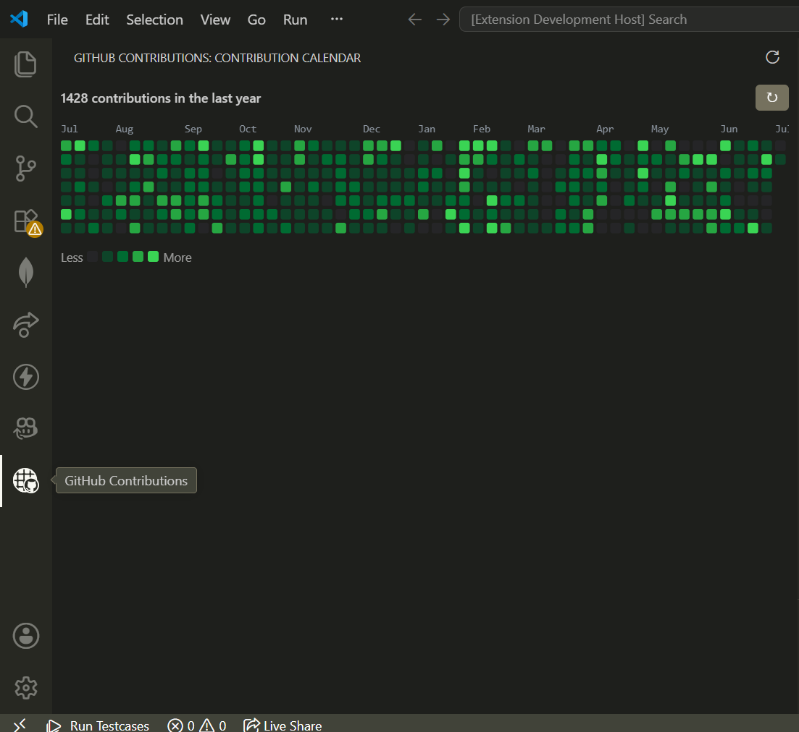
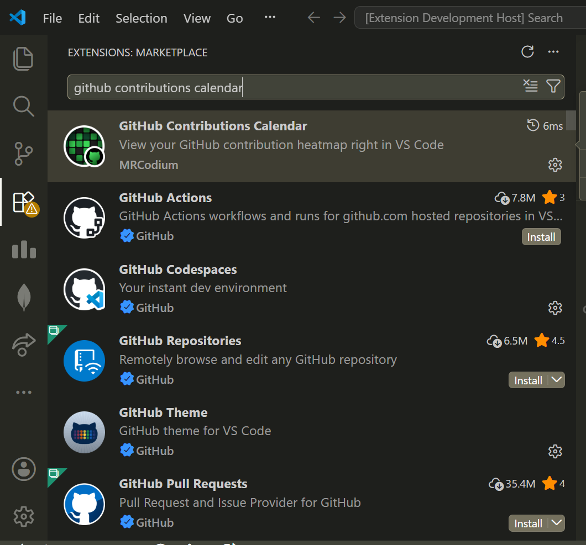
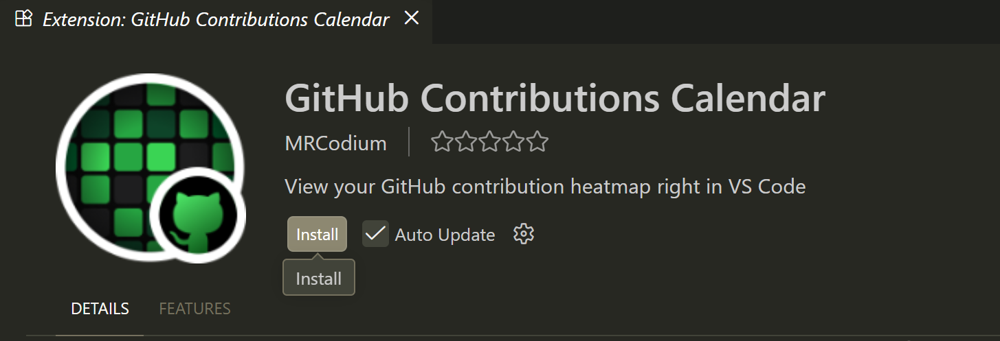

<div align="center">
  

  <h1>GitHub Contributions Calendar</h1>

  <p>
    A VS Code extension that shows your GitHub contribution heatmap right in
    the sidebar — no browser tab, no manual token, just your usual GitHub sign-in.
  </p>

  <p align="center">
  <a href="https://marketplace.visualstudio.com/items?itemName=mrcodium.github-contributions-calendar">
    
    <span style="font-size: 24px; font-weight: 700; vertical-align: middle;">
      Install from Marketplace
    </span>
  </a>
</p>

  <p>
    <a href="https://marketplace.visualstudio.com/search?term=github%20contributions%20calendar&target=VSCode&category=All%20categories&sortBy=Relevance">Marketplace</a> ·
    <a href="https://github.com/abhijeetsinghrajput/github-contributions-calendar/issues">Issues</a> ·
    <a href="https://github.com/abhijeetsinghrajput/github-contributions-calendar/issues/new">Request Feature</a>
  </p>

  <p>
    
    
    
    
    
  </p>
</div>

<details>
<summary>Table of Contents</summary>

- [About](#-about)
- [Getting Started](#-getting-started)
- [Features](#-features)
- [Contributing](#-contributing)
- [How It Works](#how-it-works)
- [Development](#development)
- [Roadmap](#-roadmap)
- [Follow Me](#-follow-me)
- [Give A Star](#-give-a-star)
- [License](#-license)

</details>

## 📖 About

**GitHub Contributions Calendar** brings your GitHub profile's contribution
heatmap directly into VS Code. Sign in once with your GitHub account, and the
Activity Bar shows a live, scalable SVG heatmap of your last 12 months of
contributions — styled to match your current VS Code theme, light or dark.

Under the hood it uses VS Code's built-in GitHub authentication provider (so
there's no personal access token to create, copy, or manage) and queries
GitHub's own GraphQL contribution API, the same data source that powers the
heatmap on github.com.



## 🚀 Getting Started

**1. Install the extension**

Open the Extensions view (`Ctrl+Shift+X` / `Cmd+Shift+X`), search for
**"GitHub Contributions Calendar"**, and click **Install**. Or install it
directly from the [VS Code Marketplace](https://marketplace.visualstudio.com/search?term=github%20contributions%20calendar&target=VSCode&category=All%20categories&sortBy=Relevance).



**2. Open the panel**

Click the GitHub Contributions icon in the Activity Bar (the vertical strip
of icons on the far left of VS Code).



**3. Sign in with GitHub**

Click **Sign in to GitHub**. VS Code will open your browser to the standard
GitHub authorization page — approve it, and switch back to VS Code. Your
heatmap loads automatically.


That's it — no tokens, no config files. Use the refresh (↻) button in the
view's title bar any time you want to pull the latest counts.

## ✨ Features

- 📅 Full contribution heatmap (last 12 months), scaled to fit your sidebar — no horizontal scrolling
- 🔐 Uses VS Code's built-in GitHub sign-in — no personal access token to create or paste
- 🌗 Matches your VS Code theme (light/dark), and updates live if you switch themes
- 🔄 One-click refresh, right in the view's title bar

## 🔧 Contributing


Contributions are what make the open source community such an amazing place
to learn, inspire, and create. Any contributions you make are **greatly
appreciated**.

1. Fork the repo
2. Create a new branch (`git checkout -b improve-feature`)
3. Make your changes
4. Commit your changes (`git commit -am 'Improve feature'`)
5. Push to the branch (`git push origin improve-feature`)
6. Open a Pull Request

Please open an issue first to discuss what you'd like to change.

## How It Works

- Authentication uses `vscode.authentication.getSession('github', ...)` —
  VS Code's own GitHub sign-in flow. Your credentials never touch this
  extension directly; VS Code manages the session for you.
- Contribution data comes from GitHub's GraphQL API
  (`contributionsCollection.contributionCalendar`), the same data source
  that powers the heatmap on your GitHub profile.
- The heatmap is rendered as a single scalable SVG (with month labels),
  so it resizes cleanly with the sidebar instead of scrolling.
- Colors are theme-aware: a light and dark palette are picked based on
  your current VS Code color theme.

## Development

Want to modify or build this extension locally?

```bash
npm install
npm run build
```

Then press **F5** in VS Code (with this folder open as the workspace root)
to launch an "Extension Development Host" window with your changes loaded.

| Method          | Description                                  | Action          |
| --------------- | -------------------------------------------- | --------------- |
| 🔧 Manual Build | Bundle the extension into `out/extension.js` | `npm run build` |
| 📦 Package      | Produce an installable `.vsix` file          | `vsce package`  |

```bash
npm install -g @vscode/vsce   # if not already installed
npm run build
vsce package
```

Install the resulting `.vsix` locally via **Extensions: Install from
VSIX...** in the Command Palette, or publish it with `vsce publish`.

## 🗺️ Roadmap

- Cache the last fetched data (`context.globalState`) so the view isn't blank
  while refetching
- Add a status bar item showing today's contribution count
- Let the user view another GitHub username's calendar, not just their own

## 📡 Follow Me

<p>
  <a href="https://github.com/abhijeetsinghrajput"></a>
  <a href="https://linkedin.com/in/your-linkedin-handle"></a>
  <a href="https://youtube.com/@mrcodium"></a>
</p>

## ⭐ Give A Star

If you found this project useful, give it a star to help more people discover it!

## 📄 License

MIT License — see [LICENSE](LICENSE) for details.
